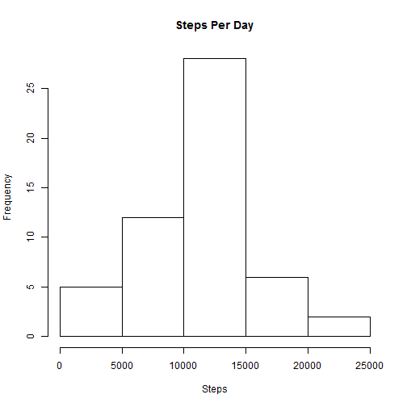

## Loading and preprocessing the data
Set working directory, unzip & read activity.csv data set

```r
setwd("C:/Users/peper/OneDrive/Documents/Coursera JHU Data Science Specialization/Reproducible Research/RepData_PeerAssessment1")
unzip("activity.zip")
activity <- read.csv("activity.csv")
```

## What is mean total number of steps taken per day?
Create histogram of total daily steps

```r
day_sum <- with(activity, tapply(steps, date, sum))
hist(day_sum, xlab = "Steps", main = "Steps Per Day")
```



Calculate mean & median steps per day

```r
mean(day_sum, na.rm = TRUE)
```

```
## [1] 10766.19
```

```r
median(day_sum, na.rm = TRUE)
```

```
## [1] 10765
```

## What is the average daily activity pattern?
Plot the mean steps for each time interval over all the days in the data set

```r
interval_mean <- with(activity, tapply(steps, interval, mean, na.rm = TRUE))
plot(names(interval_mean), interval_mean, type = "l", xlab = "Interval", ylab = "Means Steps", main = "Mean Steps by Time Interval")
```


Calculate the time interval with the highest average number of steps

```r
max_steps <- which(interval_mean == max(interval_mean))
interval_mean[max_steps]
```

```
##      835 
## 206.1698
```

## Imputing missing values
Calculate the number of entries with missing values

```r
nrow(activity[!complete.cases(activity),])
```

```
## [1] 2304
```

Impute missing values with the mean number of steps for the interval across all days

```r
activity_impute <- activity
activity_impute$steps <- ave(activity_impute$steps, activity_impute$interval, FUN = function(x){ifelse(is.na(x), mean(x, na.rm = TRUE), x)})
```

Create histogram of total steps per day with values imputed

```r
day_sum_impute <- with(activity_impute, tapply(steps, date, sum))
hist(day_sum_impute, xlab = "Steps", main = "Steps Per Day (with imputing)")
```


Calculate mean & median steps per day with values imputed

```r
mean(day_sum_impute, na.rm = TRUE)
```

```
## [1] 10766.19
```

```r
median(day_sum_impute, na.rm = TRUE)
```

```
## [1] 10766.19
```

## Are there differences in activity patterns between weekdays and weekends?
Create factor variable indicating weekday or weekend

```r
activity_impute$day.type <- factor(weekdays(as.POSIXlt(activity_impute$date)) %in% c("Saturday", "Sunday"), c(FALSE, TRUE), c("weekday", "weekend")) 
```

Load lattice & dpylr packages, calculate mean steps for weekday vs. weekend, create lattice plot of mean for each type of day

```r
library(lattice)
library(dplyr)
mean_interval_type <- activity_impute %>% group_by(day.type, interval) %>% summarize(steps = mean(steps))
xyplot(steps ~ interval | day.type, mean_interval_type, layout = c(1,2), type = "l")
```


